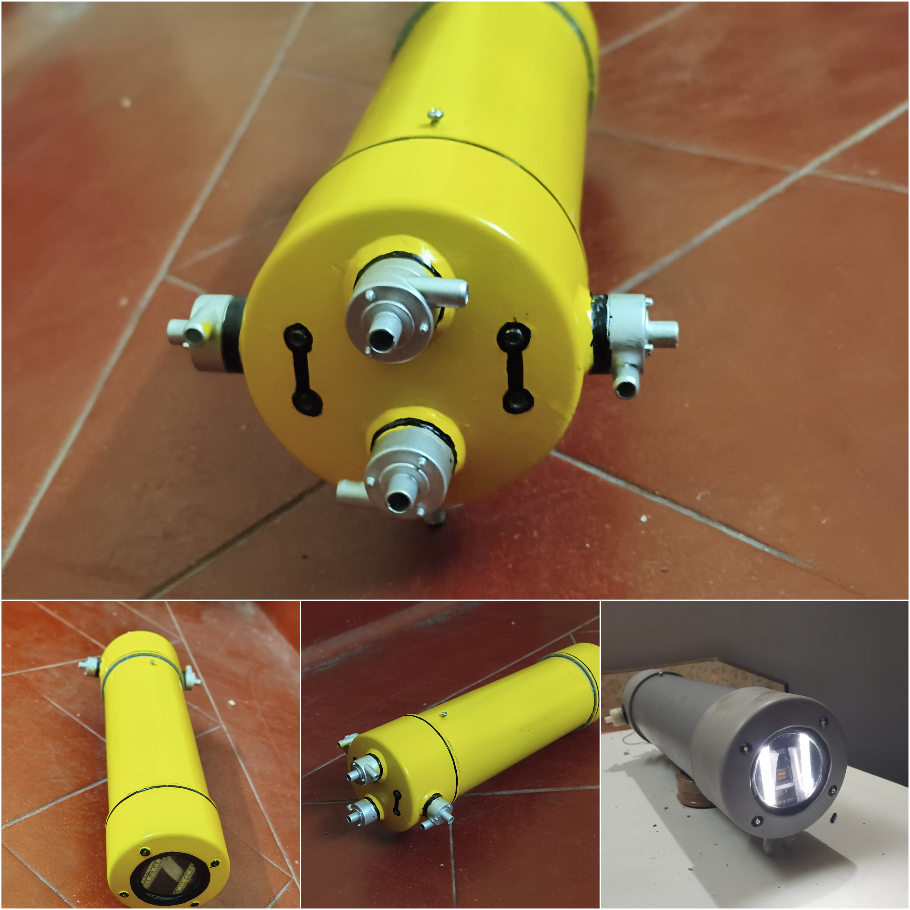
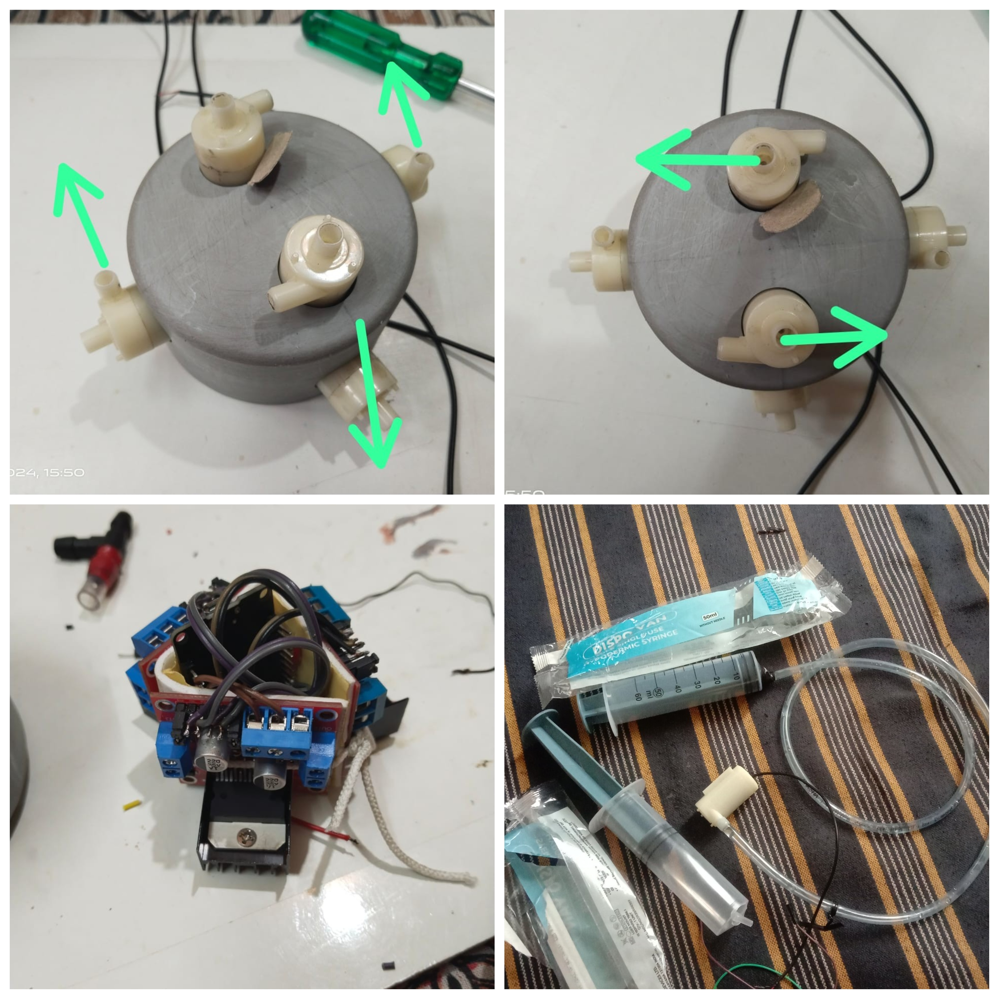
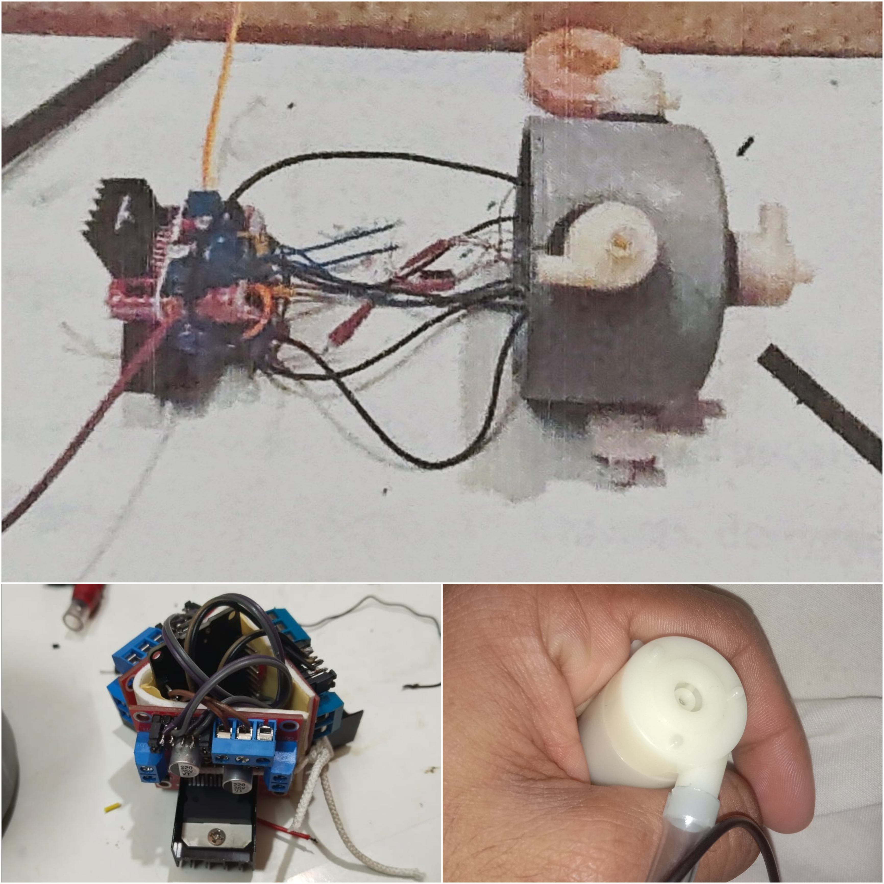

# 🌊 Underwater Exploration Drone (ROV)

Low-cost ESP32-based Remotely Operated Vehicle (ROV) designed for underwater inspection, environmental monitoring, and educational research applications.

This project integrates embedded systems, propulsion control, ballast-based buoyancy regulation, and real-time wireless video streaming using ESP32 and ESP32-CAM modules.

---

## 📌 Project Overview

The Underwater Exploration Drone is a semi-autonomous underwater vehicle developed as a final-year Robotics & AI engineering project.

The system features:

- Multi-directional propulsion
- Ballast-based buoyancy control
- WiFi-based remote navigation
- Real-time MJPEG video streaming
- Modular embedded architecture

The design focuses on low-cost hardware, modular control logic, and practical underwater maneuverability.

---

## 🏗 System Architecture

The system consists of two primary embedded controllers:

### 1️⃣ ESP32 – Motion & Control Unit
Responsible for:
- Horizontal thruster control (4 submersible pumps)
- Vertical thrust control
- Ballast system control (sink/surface)
- LED lighting system
- WiFi-based web control interface

### 2️⃣ ESP32-CAM – Vision System
Responsible for:
- Real-time MJPEG streaming
- Wireless monitoring
- Resolution & quality adjustment via web interface

---

## ⚙️ Hardware Components

- ESP32 Development Board  
- ESP32-CAM (AI Thinker Module)  
- L298N Dual H-Bridge Motor Driver  
- 4 × Submersible Pumps (Horizontal Propulsion)  
- 1 × Vertical Thruster Pump  
- 2 × Diaphragm Pumps (Ballast Fill / Release)  
- 12V Lithium-Ion Battery Pack  
- LED Strip Lighting  
- Custom PVC Waterproof Enclosure  

---

## 🔋 Power Architecture

- 12V battery powers propulsion system  
- Voltage regulation for 5V logic circuits  
- Centralized power distribution system  

---

## 🚀 Features

- Forward / Reverse navigation  
- Left / Right turning  
- Vertical upward thrust  
- Controlled sinking (ballast fill)  
- Controlled surfacing (ballast release)  
- Real-time live video streaming  
- Web-based control interface  
- Adjustable camera resolution and quality  

---

## 🌐 Communication System

The ROV operates in *WiFi Access Point Mode*.

### Control System:
- ESP32 hosts a web server
- Commands triggered via HTTP routes
- Browser-based control interface

### Video System:
- MJPEG stream over HTTP
- Real-time frame capture using esp_camera API
- Adjustable frame resolution (QVGA/VGA)

---

## 📊 Performance Metrics

| Parameter | Value |
|-----------|--------|
| Forward Velocity | ~2.5 m/s |
| Reverse Velocity | ~1.5 m/s |
| Turning Radius | ~1 meter |
| Depth Response Time | ~8 seconds |
| Signal Stability | ~95% within 15m |
| Battery Runtime | ~90 minutes |

---

## 🧠 Control Logic Design

The motion control firmware follows a modular architecture:

- Centralized thruster shutdown function
- REST-style command routing
- Non-blocking web server handling
- Structured hardware abstraction

Ballast control enables buoyancy regulation through timed diaphragm pump activation.

---

## 📂 Repository Structure

Underwater-Exploration-Drone/
│
├── firmware/
│   └── main_control.ino
│
├── esp32_cam/
│   └── camera_stream.ino
│
├── images/
│   └── hardware_prototype.jpg
│
└── README.md

---

## 🛠 Installation & Setup

### ESP32 Control Firmware

1. Open Arduino IDE  
2. Select Board: *ESP32 Dev Module*  
3. Upload firmware/main_control.ino  
4. Connect to WiFi network:
   - SSID: Underwater_ROV  
   - Password: 12345678  
5. Open browser and enter displayed IP address  

---

### ESP32-CAM Firmware

1. Select Board: *AI Thinker ESP32-CAM*  
2. Set Partition Scheme: *Huge APP (3MB No OTA)*  
3. Upload esp32_cam/camera_stream.ino  
4. Connect to:
   - SSID: Underwater_CAM  
   - Password: 12345678  

---

## 🔍 Future Improvements

- Pressure sensor-based closed-loop depth control  
- PID stabilization algorithm  
- Sonar integration for obstacle detection  
- Underwater acoustic communication  
- ROS2 simulation model  
- Autonomous waypoint navigation  

---

## 🎓 Project Context

Robotics & AI Engineering Project  
Focused on embedded systems integration and underwater robotic platform development.

## 📸 Hardware Prototype

### 🔹 Complete ROV Structure

### 🔹 Thruster Configuration

### 🔹 Motor Driver & Control System

---

## 📜 License

This project is open-source for academic and educational purposes.
